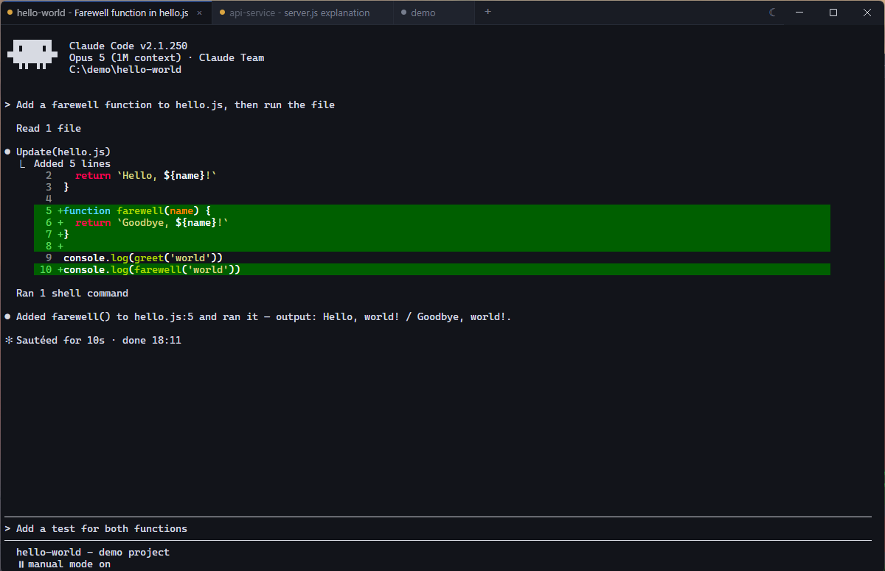

# aterm

A lean terminal host for AI agents on Windows. Tabs like Windows Terminal — plus it
knows what Claude Code is doing: a tab tells you when its agent wants something, tabs
survive a restart, and earlier sessions can be found again and resumed.



## What it does

### Tabs that tell you something

A tab is called **`<folder> - <what the session is about>`**, so a screenful of them
still says which is which. Drag to reorder, middle-click or `×` to close — closing a
tab with something running asks first.

The dot in front carries the state: it **pulses amber** when Claude Code is waiting
for you, and breathes while it is working. A wait you have not seen yet also flashes
the taskbar button — walk away, come back, and you know which tab wants you. Looking
at the tab is the answer; there is nothing to dismiss.

### Sessions you can find again

Tabs are saved on exit and restored on start, but **lazily**: they are all there
immediately, and a tab's process only starts when you click it or press `Enter`. A
window full of yesterday's work costs nothing until you touch it.

`Ctrl+Shift+O` opens the session list — everything Claude Code has run recently,
grouped by project, filtered as you type, whether or not aterm started it. Pick a
session to resume it, or **New session** to start a fresh one in that project. A
session that is already open in a tab says so and takes you there instead.

Whether a session can be resumed at all is decided by looking at it, not by a flag
somebody remembered to set — and aterm keeps up when a conversation moves out from
under a tab, so a `/clear` or a `/resume` does not cost you the thread on the next
restart.

### `claude` typed by hand counts too

Run `claude` yourself in a PowerShell tab and aterm quietly notes which session that
was. Next time the tab comes back it offers to continue it — one click inserts
`claude --resume <id>` and leaves the Enter to you, because a shell tab may well be
meant for something else entirely.

### Opening a new tab

`Ctrl+T` opens a small menu instead of guessing:

- Claude Code in the current folder
- Claude Code in a fresh **git worktree** of it (`claude --worktree`, offered where
  there is a repository) — the tab still carries the project's name, so the worktree
  does not disappear into a path nobody recognises
- Claude Code or PowerShell in a folder you pick
- straight to the session list

`Ctrl+Shift+T` skips the menu for a PowerShell tab.

### Comfort

Light, dark or follow-the-system, on the button at the right end of the tab bar —
which is also the window's title bar. Scrollback search on `Ctrl+Shift+F`, font size
on `Ctrl++`/`Ctrl+-` or `Ctrl+Wheel`, paste that turns a clipboard image into a file
Claude Code can read, and Unicode 11 width tables so `✅ ❌ 📁` stop eating the space
behind them.

## Key bindings

| Key | Effect |
|---|---|
| `Ctrl+T` | New tab menu |
| `Ctrl+Shift+T` | New PowerShell tab, straight away |
| `Ctrl+W` | Close tab |
| `Ctrl+Tab` / `Ctrl+Shift+Tab` | Next / previous tab (also `Ctrl+PageDown` / `Ctrl+PageUp`) |
| `Ctrl+1…9` | Jump to a tab |
| `Enter` | On a tab that has not started yet: open it |
| `Ctrl+Shift+O` | Session list |
| `Ctrl+Shift+F` | Search the scrollback |
| `Ctrl+V` | Paste — text directly, an image as a file in the temp directory (the path is pasted) |
| `Alt+V` | Passed through as `ESC v` → Claude Code's own image paste |
| `Shift+Enter` | Newline in the prompt (`ESC CR`) |
| `Ctrl+C` | Copy when there is a selection, interrupt when there is none |
| `Ctrl+Shift+C` / `Ctrl+Shift+V` | Explicit copy / paste |
| `Ctrl++` / `Ctrl+-` / `Ctrl+0` | Font size |
| `Ctrl+Wheel` | Font size, one step per wheel notch |

Rebind via `%APPDATA%\aterm\keymap.json`. An entry replaces the default for that
action entirely; an empty array disables it:

```json
{
  "newClaudeTab": ["Ctrl+N"],
  "sessionPicker": ["Ctrl+P", "Ctrl+Shift+O"],
  "search": []
}
```

Actions: `newTabMenu`, `newClaudeTab`, `newShellTab`, `closeTab`, `nextTab`,
`previousTab`, `sessionPicker`, `search`, `paste`, `copy`, `pasteImage`, `newline`,
`fontLarger`, `fontSmaller`, `fontReset`. `newClaudeTab` has no default — `Ctrl+T`
opens the menu instead — so bind it if you want a Claude tab in a single key.
`Ctrl+C`, `Ctrl+1…9` and `Ctrl+Wheel` are fixed.

## Configuration

| Environment variable | Effect |
|---|---|
| `ATERM_CLAUDE_PATH` | Path to `claude.exe` if it is not on the `PATH` |

Tabs, window geometry and the session ids live in `%APPDATA%\aterm\state.json`, the
key bindings next to it in `keymap.json`; theme and font size belong to the window and
stay in the renderer's local storage. A `npm run dev` instance keeps its own state
under `%APPDATA%\aterm-dev`, so it can never resume the installed app's sessions out
from under it.

Your own PowerShell `$PROFILE` is left untouched, as is `~/.claude/settings.json`.

## Development

```powershell
npm install --ignore-scripts   # the more reliable path behind a proxy
npm run setup                  # fetch the Electron binary, build node-pty against it
npm run dev
npm run typecheck              # tsc --noEmit, the only static check here
npm run build                  # NSIS installer and portable exe under dist/
npm run build:dir              # unpacked app only, much faster for a smoke test
```

Without a proxy, plain `npm install` is enough — `postinstall` calls `npm run setup`
itself. Requirements: Node ≥ 20.15, Visual Studio 2022 with the C++ tools, Python 3.

Electron, no UI framework: plain TypeScript and DOM in the renderer, and everything
that knows about processes, files and Claude Code in the main process. `CLAUDE.md`
describes how the pieces fit together — and what the session handling is really up to,
which is more involved than this page lets on.

`scripts/setup-native.mjs` works around three quirks of hardened Windows machines:

- **`NoDefaultCurrentDirectoryInExePath=1`** — otherwise cmd cannot find winpty's
  `GetCommitHash.bat` script and the gyp configure step fails.
- **Missing Spectre-mitigated MSVC libraries** (MSB8040) — the build then proceeds
  without them and says so clearly. For a mitigated build, install
  *MSVC v143 – VS 2022 C++ x64/x86 Spectre-mitigated libs* in the Visual Studio
  Installer.
- **Proxy** — the Electron download falls back to `curl`, which honours the system
  proxy.

Versions are pinned deliberately: Electron 39 is the newest release that still runs on
Node 20, and `node-gyp` is forced to ≥ 11 through `overrides` because older versions
need `distutils`, which Python 3.12 removed. With Node ≥ 22.12, Electron,
`electron-vite` and `electron-builder` can all be raised again.

### Packaging

`npm run build` runs `scripts/setup-builder-cache.mjs` first, because
electron-builder's `winCodeSign` vendor archive contains macOS symlinks and Windows
only creates symlinks with developer mode or administrator rights — without them the
extraction fails, even though a Windows build needs no macOS artifact at all. The
script extracts the archive without the `darwin` branch; enabling developer mode works
just as well.

Two more deliberate settings in the `build` configuration: `electronDist` points at
the already extracted local Electron (no second download), and `npmRebuild: false`
stops electron-builder from recompiling node-pty — `npm run setup` does that, with the
special cases above handled.

The icon is kept twice: `build/icon.ico` is stamped into the exe and the installer,
while `resources/icon.png` is shipped as a resource, because the window icon is set
from a PNG at runtime and a dev run would otherwise show the Electron default.
